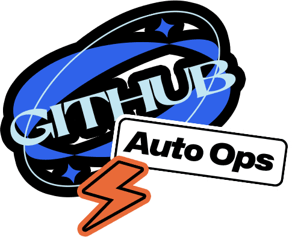
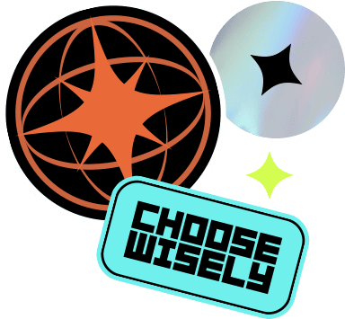
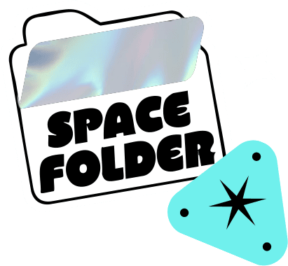
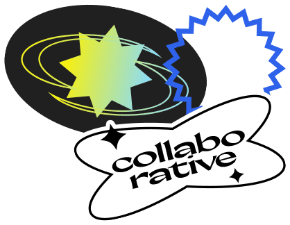
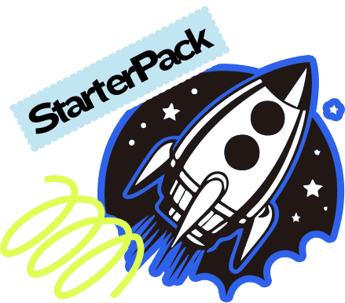

<div align="center">
  
  <a href="https://github.com/giselles-ai/giselle"></a>
  
  <a href="CONTRIBUTING.md"></a>
  <span style="font-size: 18px; color: #666; margin-left: 15px;">the AI agent studio powering product delivery</span>
  
  
  


  <!-- Light Mode Badge -->
  <a href="https://www.producthunt.com/products/giselle?embed=true&utm_source=badge-featured&utm_medium=badge&utm_source=badge-giselle" target="_blank"></a>
  
  <!-- Dark Mode Badge -->
  <a href="https://www.producthunt.com/products/giselle?embed=true&utm_source=badge-featured&utm_medium=badge&utm_source=badge-giselle" target="_blank"></a>

  <!-- Demo Video -->
[Introduciong Giselle](https://github.com/user-attachments/assets/e6add6b6-d24d-4e8c-8d24-fa626c064a5d)

  <!-- Light/Dark Mode GIFs -->
  
  
</div>
</thinking>

## 👋 Introduction

Giselle is an open source AI for agentic workflows, enabling seamless human-AI collaboration.


## ⚡ Quick Start

Get Giselle running locally in under 2 minutes:

```bash
# Clone the repository
git clone https://github.com/giselles-ai/giselle.git
cd giselle

# Install dependencies
pnpm install

# Create environment file
touch .env.local

# Add your API key (at least one required)
echo 'OPENAI_API_KEY="your_openai_api_key_here"' >> .env.local

# Start development server
pnpm turbo dev
```

Open [http://localhost:3000](http://localhost:3000) and start building your AI agents!

> **Note**: You need at least one AI provider API key. Supported providers: OpenAI, Anthropic, Google AI.

## ✨ Features

<div align="center">








</div>

- **⚡ GitHub AI Operations** - Automates issues, PRs, and deployments with AI
- **🎨 Visual Agent Builder** - Create and modify agents in minutes using an intuitive drag-and-drop interface
- **🤖 Multi-Model Composition** - Leverage GPT, Claude, Gemini, and more—agents select the best model for each task
- **📁 Knowledge Store** - Access and search your code and data from one place. GitHub vector store integration supported
- **👥 Team Collaboration** - Design agents collaboratively with shared configurations and contextual awareness *(In Development)*
- **🚀 Template Hub** - Kickstart projects with one-click agent templates—contributed by the community *(In Development)*

## 🎯 Use Cases

- **📚 Research Assistant** - Automatically gather information from web and internal docs
- **🔍 Code Reviewer** - AI-powered code review that integrates with your GitHub workflow  
- **📄 Document Generator** - Auto-create PRDs, specs, and release notes from your codebase
- **🔄 Workflow Automator** - Chain multiple AI models to handle complex business processes

## 🚀 Using Giselle

### ☁️ Cloud

We host [Giselle](https://giselles.ai/) as a cloud service for anyone to use instantly. It has all the same features as the self-hosted version, and includes 30 minutes of free Agent time per month in the free plan.

### 🏠 Self-hosting

Follow this [starter guide](CONTRIBUTING.md#development-environment-setup) to get Giselle running in your environment.

### 🎵 Vibe Coding Guide

If you're using AI coding assistants like Claude, Cursor, or WindSurf to help build with Giselle, check out our [Vibe Coding Guide](/docs/vibe/01-introduction.md). This guide explains:

- What is vibe coding and how to approach it effectively
- How to set up your Node.js environment and install dependencies
- Understanding Giselle's project structure
- Running the playground and connecting to LLM providers

Designed for both developers and non-engineers, this guide will help you harness the power of AI to build with Giselle without needing traditional coding expertise.

## 🗺️ Roadmap

Giselle is currently still in active development. The roadmap for the public repository is currently being created, and once it's finalized, we will update this README accordingly.

## 🤝 Contributing

Your contributions — big or small — help Giselle evolve and improve. Interested in joining us?

Here's how you can contribute:

- Star this repo ⭐
- Follow us on social media: [Facebook](https://www.facebook.com/GiselleAI/), [X](https://x.com/Giselles_AI), [Instagram](https://www.instagram.com/giselle_de_ai) and [YouTube](https://www.youtube.com/@Giselle_AI)
- [Report a bug](https://github.com/giselles-ai/giselle/issues/new?template=1_bug_report.yml) you encounter while using Giselle
- [Request a feature](https://github.com/giselles-ai/giselle/discussions/categories/ideas) you think would be helpful
- [Submit a pull request](CONTRIBUTING.md#how-to-submit-a-pull-request) if you'd like to add new features or fix bugs

For more details, please see our [contributing guide](CONTRIBUTING.md).

## 📄 License

Giselle is licensed under the [Apache License Version 2.0](LICENSE).

Licenses for third-party packages can be found in [docs/packages-license.md](docs/packages-license.md).
